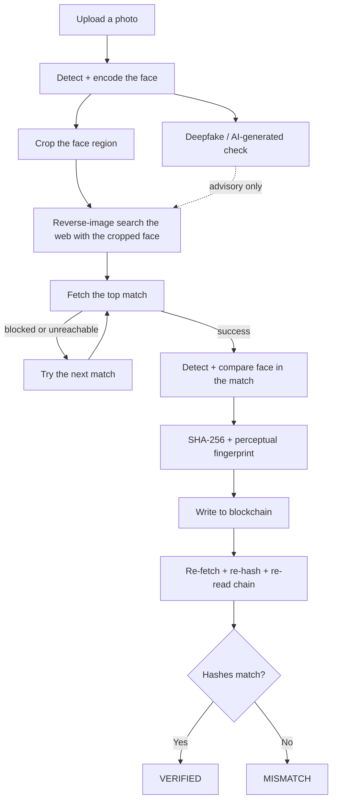

# Face ID + Blockchain Verification

Upload a photo, and this tool detects the face in it, checks whether the
photo itself looks AI-generated, crops and searches the web specifically for
that face, biometrically confirms whether the face in any match is the same
person, and writes a dual (cryptographic + perceptual) fingerprint of what it
finds to a public blockchain — so the discovery stays provable even if the
original page is later edited or deleted. Nothing in the pipeline is
hardcoded or simulated: every face comparison, search, fetch, deepfake check,
and blockchain transaction is live, and every step is shown as it happens in
a live "chain of thought" investigation dashboard.

## Architecture



| # | Step | What happens |
|---|---|---|
| 1 | Face detection | Detects the largest face, encodes it as a 128-d biometric vector, and crops it (with padding) for a face-specific search |
| 1.5 | Deepfake check | Runs a pre-trained image classifier to score whether the uploaded photo looks real or AI-generated (advisory only — never blocks the pipeline) |
| 2 | Web search | A live reverse-image search (Google Lens via SerpApi) of the **cropped face**, not the whole photo, for real matches ranked by confidence |
| 3 | Fetch | Downloads the matched image + caption; if a site blocks the request, moves to the next-ranked match automatically (up to 10 tries); re-detects the face in the matched image and computes a biometric similarity score against the original |
| 4 | Fingerprint | Hashes the image and its details (link, caption, timestamp) into a SHA-256 fingerprint, and separately computes a perceptual hash (pHash) of the image |
| 5 | Blockchain write | Records the SHA-256 fingerprint on-chain with a timestamp, submitter address, and (for Sepolia) a block explorer link |
| 6 | Re-verification | Independently re-fetches, re-hashes (both SHA-256 and pHash), and re-reads the chain to confirm nothing has changed |

An interactive **Re-verify** panel is also included: after a run finishes,
you can edit the matched post's link or caption and check it against the
blockchain again — since the fingerprint is a real function of that data,
editing it and re-checking genuinely flips the SHA-256 result to a mismatch,
while the perceptual hash comparison correctly shows the underlying image
content is unchanged.

## Tech Stack

| Layer | Technology |
|---|---|
| Backend | Python, FastAPI |
| Face detection & similarity | `face_recognition` (dlib HOG + 128-d ResNet encoding, cosine similarity) |
| Deepfake / AI-image detection | HuggingFace `transformers` + PyTorch (ViT image classifier) |
| Reverse image search | SerpApi (Google Lens), searched on the cropped face |
| Content fetching | `requests` + `BeautifulSoup` |
| Fingerprinting | SHA-256 (exact match) + perceptual hash / pHash via `imagehash` (visual similarity) |
| Blockchain | Solidity + Hardhat (local network or Sepolia testnet), accessed via `web3.py` |
| Frontend | HTML/CSS/JavaScript (vanilla, no framework), served by the backend |

## Which Blockchain, and Why

Both a local Hardhat network (for development) and Ethereum's public
**Sepolia testnet** (for the demo/submission) are supported with the exact
same contract, transactions, and verification logic — only the RPC endpoint
and private key change. Sepolia gives independent, third-party verification:
every transaction has a real block explorer link (Etherscan) that anyone,
including a judge, can open and inspect without running any of this code.
Local Hardhat remains available for fast iteration without depending on
testnet uptime, faucets, or a funded key.

## Face-Cropped Search and Biometric Similarity

The reverse-image search is run against the **cropped face region** (with
50% padding to include forehead/chin/some context), not the whole uploaded
photo — so a match is driven by the person's face, not by whatever else is
in the frame (background, other people, logos). Separately, the 128-d face
encoding computed in Stage 1 isn't just thrown away: once a match is fetched
in Stage 3, a face is detected in the *matched* image too, and its encoding
is compared to the original via cosine similarity. That similarity score
(shown as a "Face Match: 96.3%" style badge) is what turns this from "I found
a visually similar image online" into "I found this image online **and the
face in it is biometrically the same person**."

## Deepfake / AI-Generated Image Detection

Before searching the web, the uploaded photo is run through a pre-trained
image classifier (`dima806/deepfake_vs_real_image_detection`, a ViT model
fine-tuned specifically to separate real photos from AI-generated ones) to
score how likely it is to be authentic vs. synthetic. This matters because
the rest of the pipeline's trust story — "we found this face online and
verified it on-chain" — is only meaningful if the input face is real in the
first place; a GAN-generated face fed into the pipeline would otherwise be
"verified" just as confidently as a real one. The check is advisory only —
it never blocks or fails the pipeline, and if the model can't be loaded
(e.g. no network on first run, since HuggingFace downloads the ~90 MB of
weights on first use), the pipeline continues and simply reports that the
check was skipped.

## Fingerprint Design

Two kinds of hash are computed per match, on purpose, because they prove
different things:

| Hash | What It Proves |
|---|---|
| **SHA-256** (`image_hash` + `combined_hash`) | This is the *exact same file*, byte-for-byte, at the *exact same link* with the *exact same caption and timestamp* |
| **Perceptual hash / pHash** | This is *visually the same image*, even if it's been resized, recompressed, or has had its caption/URL edited |

The `combined_hash` (SHA-256 of `{image_hash, url, caption, scraped_at}`) is
what gets written on-chain, so the record proves not just "this image
exists" but "this exact image was found at this link with this caption at
this time." A change to any of those fields later produces a different
`combined_hash` and a detectable SHA-256 mismatch on re-verification — but
the perceptual hash comparison, run alongside it, will still correctly show
high visual similarity if only the metadata (not the image content) changed.
The **Re-verify** panel demonstrates exactly this: edit the caption and
re-verify, and you'll see the SHA-256 flip to a mismatch while the pHash
similarity stays at 100%.

## Getting Started

### Prerequisites

- Python 3.11
- Node.js and npm
- A free SerpApi key (250 searches/month on the free tier)
- ~1.5 GB free disk space for PyTorch + the deepfake-detection model weights
  (downloaded once, on first use, from HuggingFace)

### Install

```bash
# Backend
python -m venv backend/.venv
backend/.venv/Scripts/pip install -r backend/requirements.txt

# Smart contract tooling
cd contracts
npm install
npx hardhat compile
cd ..
```

### Configure

Copy `.env.example` to `.env` and fill in:

- `SERPAPI_KEY` — your SerpApi key
- Either the local Hardhat vars (`HARDHAT_RPC_URL`, `HARDHAT_PRIVATE_KEY`) or
  the Sepolia vars (`CHAIN_RPC_URL`, `CHAIN_PRIVATE_KEY`, `BLOCK_EXPLORER_URL`)
  — see the two options below
- `CONTRACT_ADDRESS` — filled in after deploying the contract (see below)

### Run — Option A: local Hardhat (development)

Three terminals, from the project root:

```bash
# 1. Local blockchain — leave running
cd contracts && npx hardhat node
```

Copy `Account #0`'s printed private key into `.env` as `HARDHAT_PRIVATE_KEY`.

```bash
# 2. Deploy the contract (once per fresh node run)
cd contracts && npx hardhat run scripts/deploy.js --network localhost
```

Copy the printed address into `.env` as `CONTRACT_ADDRESS`.

```bash
# 3. Start the app
cd backend && .venv/Scripts/python.exe -m uvicorn app.main:app --port 8000
```

Open **http://127.0.0.1:8000**, choose a photo, and click **Start
verification**.

### Run — Option B: Sepolia testnet (demo / submission)

1. Get a Sepolia RPC URL (e.g. from Infura or Alchemy) and a funded Sepolia
   test account's private key (fund it from a public Sepolia faucet — never
   use a real/mainnet key).
2. Set `SEPOLIA_RPC_URL` and `SEPOLIA_PRIVATE_KEY` in `.env` (read by
   `contracts/hardhat.config.js`), then deploy:
   ```bash
   cd contracts && npx hardhat run scripts/deploy.js --network sepolia
   ```
3. Copy the printed contract address into `.env` as `CONTRACT_ADDRESS`.
4. Set the backend's chain vars in `.env`:
   ```
   CHAIN_RPC_URL=<your Sepolia RPC URL>
   CHAIN_PRIVATE_KEY=<the same funded Sepolia private key>
   BLOCK_EXPLORER_URL=https://sepolia.etherscan.io
   ```
5. Start the app the same way as Option A, step 3. Every transaction the
   pipeline submits now shows a real "View on Etherscan ↗" link in the UI.

### Tests

```bash
cd contracts && npx hardhat test
```

Covers the contract: registering a fingerprint, rejecting a duplicate,
reading a record back, handling an unregistered hash, and per-submitter
isolation.

## Known Limitations

- **Finds reused images, not reused faces.** Even with the face crop,
  Google Lens still matches on the cropped image's visual content — it does
  not search for *different* photos of the same person, which would require
  a dedicated biometric search service and raises much higher privacy
  concerns. The Stage 3 biometric similarity score confirms whether a given
  match's face is the same person, but it doesn't discover matches on its
  own.
- **Depends on prior indexing.** A photo that has never been posted
  anywhere will correctly return zero matches.
- **No liveness detection** — confirms a face is present, not that the
  photo was taken live.
- **Deepfake detection is a single general-purpose classifier**, not a
  guarantee. It's a real, live model-inference signal (not hardcoded), but
  like any classifier it can be wrong, especially on image styles it wasn't
  trained on; it's surfaced as an advisory signal, not a hard block.
- **Only the SHA-256 fingerprint (not the perceptual hash) is written
  on-chain.** The pHash is computed and compared client-side/server-side on
  every run and re-verification, but isn't part of the immutable on-chain
  record itself.
- **Local Hardhat mode has no public block-explorer link** (only Sepolia
  mode does) — every other guarantee (signing, submitting, independent
  re-reading) works identically in both modes.
- **250 searches/month** on the SerpApi free tier used here.
- **Sepolia mode requires a funded testnet account and an RPC provider**
  (e.g. Infura/Alchemy); local Hardhat mode has neither requirement.

## Ethics Note

Intended for checking whether your own photos have been reused without
consent (e.g. a fake profile using your picture) — not for looking up other
people without their knowledge. Demonstrations should only use public
figures' publicly available photos.
