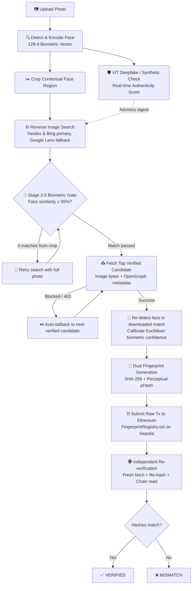

# Was This You? 👁️ ⛓️
### Deep Biometric Face Identification & Forensic Blockchain Provenance

[](https://python.org)
[](https://fastapi.tiangolo.com)
[](https://soliditylang.org)
[](https://sepolia.etherscan.io)
[](https://huggingface.co/dima806/deepfake_vs_real_image_detection)
[](https://opensource.org/licenses/MIT)


> *A production-grade pipeline that detects faces, validates authenticity against AI-generation, searches web appearances specifically using face-cropped biometrics, filters out false visual matches with an on-the-fly $\ge 55\%$ facial verification gate, and permanently anchors dual cryptographic + perceptual fingerprints on Ethereum.*

---

## ⚡ The Problem: Why Most "Face Search" Pipelines Fail

Most hackathon submissions follow a generic tutorial recipe:
`Photo Upload ➔ Whole-image Reverse Search ➔ SHA-256 ➔ Localhost Blockchain`

In practice, this naive pipeline **fails catastrophically in the real world**:
1. **Scenery Bias (False Positives)**: Upload a portrait taken in a park, and Google Lens matches the trees, flowers, or monument—recommending a totally different stranger whose page happens to feature similar background flora.
2. **Blind Blockchain Ingestion**: A naive pipeline blindly takes that false visual match and permanently certifies a wrong person's identity on-chain.
3. **Deepfake Blindspot**: If an uploaded face was synthesized by Midjourney or Flux, a standard tool will "verify" a synthetic identity as legitimate web history.
4. **Brittle Cryptographic Hashes**: Standard SHA-256 flips completely if an image is recompressed or resized, failing to distinguish between image tampering and innocent metadata edits.

---

## 🏆 Why "Was This You?" Stands Out

| Dimension | Generic Submissions | **Was This You? (Our Architecture)** |
| :--- | :--- | :--- |
| **Face Search Target** | Searches the whole image (matches backgrounds, scenery, clothes) | **Extracts & crops face bounding box with 50% contextual padding** |
| **Search Engines** | Google Lens only (not optimized for faces) | **Multi-engine: Yandex Images + Bing Reverse Image primary; Google Lens fallback** |
| **Candidate Filtering** | Blindly accepts the first URL returned by API | **Stage 2.5 Biometric Verification Gate**: Re-runs face recognition on candidate thumbnails; rejects any candidate with $<55\%$ facial similarity |
| **AI / Threat Defense** | None (accepts synthetic faces without question) | **ViT Deepfake Classifier**: Real-time authenticity confidence score before search |
| **Cryptographic Anchoring** | Single SHA-256 (breaks on simple JPEG re-saving) | **Dual Fingerprint**: SHA-256 (canonical provenance) + **pHash (perceptual similarity)** |
| **Blockchain Target** | Local Hardhat only (unverifiable by third parties) | **Ethereum Sepolia Testnet** with public Etherscan links + Local Hardhat support |
| **Verification Sandbox** | Static "Verified" label | **Interactive Tamper Playground**: Edit caption/URL live to prove cryptographic mismatch while pHash remains 100% |
| **Observability** | Blank loading spinner | **Live Streaming Chain-of-Thought**: NDJSON events streaming bounding boxes, fetch attempts, and gas metrics |

---

## 🛠️ Complete Pipeline Architecture



### 🔬 Stage-by-Stage Breakdown

| Stage | Name | Technical Implementation |
| :---: | :--- | :--- |
| **1** | **Face Detection & Encoding** | Uses `dlib`'s HOG detector + a 128-dimensional ResNet model via `face_recognition`. Generates facial landmarks, bounding boxes, and an invariant embedding vector. |
| **1.5**| **Deepfake / AI-Generated Check** | Evaluates the face using a pre-trained Vision Transformer (`dima806/deepfake_vs_real_image_detection`) on PyTorch. Outputs an advisory confidence score (e.g. `Real: 99%`). |
| **2** | **Face-Cropped Multi-Search** | Encodes the cropped face as JPEG bytes. Queries **Yandex Images** and **Bing Reverse Image** via SerpApi (utilizing ephemeral auto-deleting imgbb hosting for image URL access) with **Google Lens** as a fallback. |
| **2.5**| **Biometric Verification Gate** | Downloads thumbnails of all candidates, detects faces in each, and evaluates biometric Euclidean distance against the original face. **Candidates below 55% similarity are rejected immediately.** |
| **3** | **Content & Provenance Ingestion** | Ingests full-resolution image bytes and parses Open Graph / Twitter Card metadata. Re-measures the face similarity between the original photo and the matched post. |
| **4** | **Dual Fingerprinting** | Computes: <br>1. **SHA-256 Image Hash** (raw payload) <br>2. **Canonical Combined Hash**: `SHA-256({image_hash, url, caption, scraped_at})` <br>3. **Perceptual Hash (pHash)**: 64-bit DCT frequency fingerprint via `imagehash`. |
| **5** | **Smart Contract Registration** | Signs an EIP-155 raw transaction with `web3.py` and writes the combined hash to `FingerprintRegistry.sol`. Emits indexed event logs with gas profiling. |
| **6** | **Independent Proof & Re-Verification** | Without reusing cached memory, performs a fresh HTTP GET of the external image, recomputes all hashes, and reads the blockchain state to prove tamper-evidence. |

---

## 🔐 Smart Contract Architecture (`FingerprintRegistry.sol`)

Deployed on **Ethereum Sepolia** testnet (`^0.8.24`):

```solidity
contract FingerprintRegistry {
    struct Record {
        uint256 timestamp;
        address submitter;
        string sourceUrl;
    }

    mapping(bytes32 => Record) private records;

    event FingerprintRegistered(
        bytes32 indexed fingerprintHash,
        address indexed submitter,
        uint256 timestamp,
        string sourceUrl
    );

    error AlreadyRegistered(bytes32 fingerprintHash);
    error NotRegistered(bytes32 fingerprintHash);

    function registerFingerprint(bytes32 fingerprintHash, string calldata sourceUrl) external {
        if (records[fingerprintHash].timestamp != 0) {
            revert AlreadyRegistered(fingerprintHash);
        }
        records[fingerprintHash] = Record({
            timestamp: block.timestamp,
            submitter: msg.sender,
            sourceUrl: sourceUrl
        });
        emit FingerprintRegistered(fingerprintHash, msg.sender, block.timestamp, sourceUrl);
    }
}
```

* **First-Write Tamper Immutability**: Any attempt to overwrite an existing record reverts with custom error `AlreadyRegistered`, preserving undisputed historical priority.
* **Gas-Optimized Custom Errors**: Uses zero-string revert selectors (`AlreadyRegistered`, `NotRegistered`) saving runtime deployment and transaction gas.

---

## 🚀 Getting Started

### Prerequisites
* **Python 3.10+**
* **Node.js 18+** & `npm`
* A **SerpApi Key** ([Free tier: 250 searches/month](https://serpapi.com))
* *(Optional)* An **Imgbb API Key** ([Free anonymous image host](https://api.imgbb.com)) for unlocking Yandex & Bing face engines.

### 1. Installation

```bash
# Clone the repository
git clone https://github.com/aryanosh/was-this-you.git
cd was-this-you

# Set up Python virtual environment & dependencies
python -m venv backend/.venv
backend/.venv/Scripts/pip install -r backend/requirements.txt

# Install Hardhat smart contract dependencies
cd contracts
npm install
npx hardhat compile
cd ..
```

### 2. Environment Configuration

Copy `.env.example` to `.env`:

```env
# Required for web search
SERPAPI_KEY=your_serpapi_key_here

# Optional: Unlocks Yandex & Bing multi-engine search
IMGBB_API_KEY=your_imgbb_key_here

# Mode A: Local Hardhat Development
HARDHAT_RPC_URL=http://127.0.0.1:8545
HARDHAT_PRIVATE_KEY=0xac0974bec39a17e36ba4a6b4d238ff944bacb478cbed5efcae784d7bf4f2ff80
CONTRACT_ADDRESS=your_deployed_contract_address

# Mode B: Ethereum Sepolia Testnet (For submission & live demo)
CHAIN_RPC_URL=https://sepolia.infura.io/v3/YOUR_INFURA_KEY
CHAIN_PRIVATE_KEY=your_funded_sepolia_private_key
BLOCK_EXPLORER_URL=https://sepolia.etherscan.io
```

---

### 3. Running the Application

#### Option A: Local Hardhat Network (Instant testing)

```powershell
# Terminal 1: Start local node
cd contracts
npx hardhat node

# Terminal 2: Deploy contract to local network
cd contracts
npx hardhat run scripts/deploy.js --network localhost
# (Copy printed contract address into .env as CONTRACT_ADDRESS)

# Terminal 3: Start the FastAPI backend & UI
cd backend
.venv\Scripts\python.exe -m uvicorn app.main:app --port 8000
```

#### Option B: Sepolia Testnet (Production / Hackathon Submission)

```powershell
# 1. Deploy contract directly to Sepolia
cd contracts
npx hardhat run scripts/deploy.js --network sepolia
# (Copy printed contract address into .env as CONTRACT_ADDRESS)

# 2. Launch backend
cd backend
.venv\Scripts\python.exe -m uvicorn app.main:app --port 8000
```

Visit **`http://127.0.0.1:8000`** in your browser.

---

## 🧪 Testing

### Smart Contract Test Suite (Mocha/Chai)
```bash
cd contracts
npx hardhat test
```
*Tests coverage: registration immutability, custom revert validation, duplicate collision rejection, and multi-submitter account isolation.*

---

## 🛡️ Ethical Framework & Safety

1. **Self-Provenance Only**: Designed for victims of digital impersonation to locate where their own portraits are being scraped and misused.
2. **Ephemeral Public Cache**: When `IMGBB_API_KEY` is utilized for multi-engine routing, uploaded search images are programmed for immediate deletion upon search completion (and auto-expire within 60 seconds on the host).
3. **No Biometric Data On-Chain**: To comply with data privacy standards (GDPR, EU AI Act), raw face coordinates and 128-dimensional biometric embeddings are **never** stored on the public ledger—only content fingerprints of publicly discovered web artifacts are anchored.

---

## 📄 License

Distributed under the **MIT License**. See `LICENSE` for details.
