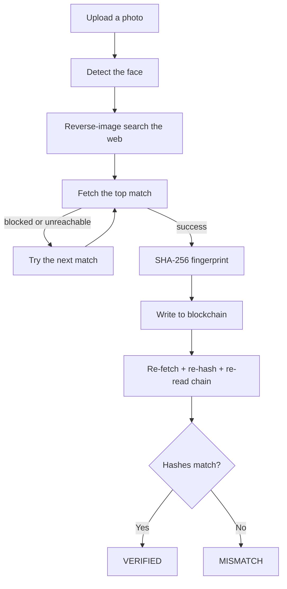

# Face ID + Blockchain Verification

Upload a photo, and this tool finds real places on the web where it has
been reused — then writes a cryptographic fingerprint of what it finds to
a blockchain, so the discovery stays provable even if the original page is
later edited or deleted. Nothing in the pipeline is hardcoded or simulated:
every search, fetch, and blockchain transaction is live.

## Architecture



| # | Step | What happens |
|---|---|---|
| 1 | Face detection | Confirms a real face is in the photo and encodes it |
| 2 | Web search | A live reverse-image search (Google Lens via SerpApi) for real matches, ranked by confidence |
| 3 | Fetch | Downloads the matched image + caption; if a site blocks the request, moves to the next-ranked match automatically (up to 10 tries) |
| 4 | Fingerprint | Hashes the image and its details (link, caption, timestamp) into one SHA-256 fingerprint |
| 5 | Blockchain write | Records the fingerprint on-chain with a timestamp and submitter address |
| 6 | Re-verification | Independently re-fetches, re-hashes, and re-reads the chain to confirm nothing has changed |

An interactive **Re-verify** panel is also included: after a run finishes,
you can edit the matched post's link or caption and check it against the
blockchain again — since the fingerprint is a real function of that data,
editing it and re-checking genuinely flips the result to a mismatch.

## Tech Stack

| Layer | Technology |
|---|---|
| Backend | Python, FastAPI |
| Face detection | `face_recognition` |
| Reverse image search | SerpApi (Google Lens) |
| Content fetching | `requests` + `BeautifulSoup` |
| Fingerprinting | SHA-256 |
| Blockchain | Solidity + Hardhat (local network), accessed via `web3.py` |
| Frontend | HTML/CSS/JavaScript, served by the backend |

## Which Blockchain, and Why

A local Ethereum-compatible network (via Hardhat), not a public chain. The
contract, transactions, and verification logic are identical to what they'd
be on a public network — only the RPC address would need to change to move
this there. Running locally avoids depending on external network uptime,
test-faucet availability, or handling real funds/keys, while keeping every
guarantee (signed transactions, on-chain reads, tamper-evidence) fully
intact.

## Fingerprint Design

Two SHA-256 hashes are computed per match: an **image hash** (the raw
downloaded bytes) and a **combined hash** (the image hash plus the source
link, caption, and fetch time, bundled together). The combined hash is what
gets written on-chain — so the record proves not just "this image exists,"
but "this exact image was found at this link with this caption at this
time." A change to any of those later produces a different hash and a
detectable mismatch on re-verification.

## Getting Started

### Prerequisites

- Python 3.11
- Node.js and npm
- A free SerpApi key (250 searches/month on the free tier)

### Install

```bash
# Backend
python -m venv backend/.venv
backend/.venv/Scripts/pip install -r backend/requirements.txt

# Smart contract tooling
cd contracts
npm install
npx hardhat compile
cd ..
```

### Configure

Copy `.env.example` to `.env` and fill in:

- `SERPAPI_KEY` — your SerpApi key
- `HARDHAT_RPC_URL` — leave as `http://127.0.0.1:8545`
- `HARDHAT_PRIVATE_KEY` — a test account key Hardhat prints on startup (see below)
- `CONTRACT_ADDRESS` — filled in after deploying the contract (see below)

### Run

Three terminals, from the project root:

```bash
# 1. Local blockchain — leave running
cd contracts && npx hardhat node
```

Copy `Account #0`'s printed private key into `.env` as `HARDHAT_PRIVATE_KEY`.

```bash
# 2. Deploy the contract (once per fresh node run)
cd contracts && npx hardhat run scripts/deploy.js --network localhost
```

Copy the printed address into `.env` as `CONTRACT_ADDRESS`.

```bash
# 3. Start the app
cd backend && .venv/Scripts/python.exe -m uvicorn app.main:app --port 8000
```

Open **http://127.0.0.1:8000**, choose a photo, and click **Start
verification**.

### Tests

```bash
cd contracts && npx hardhat test
```

Covers the contract: registering a fingerprint, rejecting a duplicate,
reading a record back, handling an unregistered hash, and per-submitter
isolation.

## Known Limitations

- **Finds reused images, not reused faces.** It matches the same photo
  (or a cropped/edited copy) appearing elsewhere — it does not search for
  *different* photos of the same person, which would require a dedicated
  biometric search service and raises much higher privacy concerns.
- **Depends on prior indexing.** A photo that has never been posted
  anywhere will correctly return zero matches.
- **No liveness detection** — confirms a face is present, not that the
  photo was taken live.
- **Local blockchain, so no public block-explorer link.** Every other
  guarantee (signing, submitting, independent re-reading) works exactly as
  it would on a public network.
- **250 searches/month** on the SerpApi free tier used here.

## Ethics Note

Intended for checking whether your own photos have been reused without
consent (e.g. a fake profile using your picture) — not for looking up other
people without their knowledge. Demonstrations should only use public
figures' publicly available photos.
